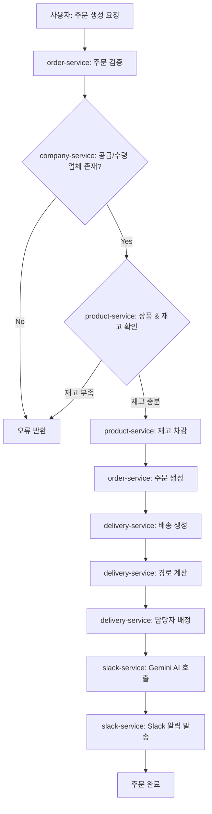
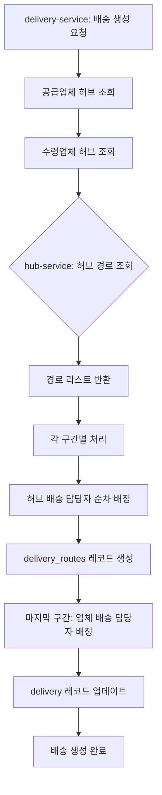
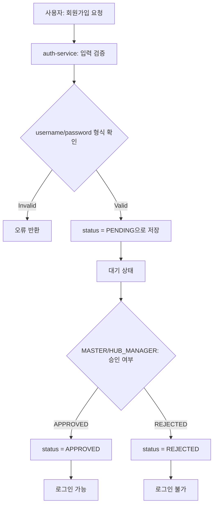

# ERD 설계 가이드

## 1. ERD 작성 도구

**추천 도구**:
- https://dbdiagram.io/ (간편, DBML 문법)
- https://app.diagrams.net/ (상세, 드래그앤드롭)

---

## 2. 서비스별 ERD 구조

### 2.1 auth-service ERD

**엔티티**: `p_users`

**관계**:
- hub_id → hub-service (논리적 FK, 점선)
- company_id → company-service (논리적 FK, 점선)

**DBML 코드**:
```dbml
Table p_users {
  username varchar(100) [pk]
  password varchar(255) [not null]
  name varchar(100) [not null]
  email varchar(255) [unique]
  slack_id varchar(100) [not null]
  role varchar(50) [not null]
  status varchar(50) [not null, default: 'PENDING']
  hub_id uuid [null]
  company_id uuid [null]
  is_public boolean [default: true]
  created_at timestamp
  created_by varchar(100)
  updated_at timestamp
  updated_by varchar(100)
  deleted_at timestamp
  deleted_by varchar(100)

  indexes {
    role
    status
    hub_id
    company_id
  }
}
```

---

### 2.2 hub-service ERD

**엔티티**: `p_hubs`, `p_hub_routes`

**관계**:
- p_hub_routes.origin_hub_id → p_hubs.hub_id (1:N)
- p_hub_routes.destination_hub_id → p_hubs.hub_id (1:N)

**DBML 코드**:
```dbml
Table p_hubs {
  hub_id uuid [pk]
  hub_name varchar(100) [not null, unique]
  address varchar(500) [not null]
  latitude decimal(10,8) [not null]
  longitude decimal(11,8) [not null]
  hub_type varchar(50) [default: 'REGIONAL']
  created_at timestamp
  created_by varchar(100)
  updated_at timestamp
  updated_by varchar(100)
  deleted_at timestamp
  deleted_by varchar(100)

  indexes {
    hub_name
    hub_type
    (latitude, longitude)
  }
}

Table p_hub_routes {
  route_id uuid [pk]
  origin_hub_id uuid [not null, ref: > p_hubs.hub_id]
  destination_hub_id uuid [not null, ref: > p_hubs.hub_id]
  distance_km decimal(10,2) [not null]
  duration_minutes integer [not null]
  route_order integer [default: 1]
  created_at timestamp
  created_by varchar(100)
  updated_at timestamp
  updated_by varchar(100)
  deleted_at timestamp
  deleted_by varchar(100)

  indexes {
    origin_hub_id
    destination_hub_id
    (origin_hub_id, destination_hub_id) [unique]
  }
}
```

---

### 2.3 company-service ERD

**엔티티**: `p_companies`

**관계**:
- hub_id → hub-service (논리적 FK, 점선)

**DBML 코드**:
```dbml
Table p_companies {
  company_id uuid [pk]
  company_name varchar(200) [not null]
  company_type varchar(50) [not null]
  hub_id uuid [not null]
  address varchar(500) [not null]
  latitude decimal(10,8) [null]
  longitude decimal(11,8) [null]
  contact_name varchar(100) [null]
  contact_phone varchar(50) [null]
  created_at timestamp
  created_by varchar(100)
  updated_at timestamp
  updated_by varchar(100)
  deleted_at timestamp
  deleted_by varchar(100)

  indexes {
    hub_id
    company_type
    company_name
  }
}
```

---

### 2.4 product-service ERD

**엔티티**: `p_products`, `p_inventory_histories`

**관계**:
- p_products.company_id → company-service (논리적 FK, 점선)
- p_products.hub_id → hub-service (논리적 FK, 점선)
- p_inventory_histories.product_id → p_products.product_id (1:N)

**DBML 코드**:
```dbml
Table p_products {
  product_id uuid [pk]
  product_name varchar(200) [not null]
  company_id uuid [not null]
  hub_id uuid [not null]
  description text [null]
  unit varchar(50) [default: '개']
  quantity integer [default: 0]
  price decimal(15,2) [null]
  created_at timestamp
  created_by varchar(100)
  updated_at timestamp
  updated_by varchar(100)
  deleted_at timestamp
  deleted_by varchar(100)

  indexes {
    company_id
    hub_id
    product_name
  }
}

Table p_inventory_histories {
  history_id uuid [pk]
  product_id uuid [not null, ref: > p_products.product_id]
  quantity_change integer [not null]
  quantity_after integer [not null]
  reason varchar(100) [not null]
  reference_id uuid [null]
  created_at timestamp
  created_by varchar(100)
  updated_at timestamp
  updated_by varchar(100)
  deleted_at timestamp
  deleted_by varchar(100)

  indexes {
    product_id
    created_at
  }
}
```

---

### 2.5 order-service ERD

**엔티티**: `p_orders`

**관계**:
- supplier_company_id → company-service (논리적 FK, 점선)
- receiver_company_id → company-service (논리적 FK, 점선)
- product_id → product-service (논리적 FK, 점선)
- delivery_id → delivery-service (논리적 FK, 점선)

**DBML 코드**:
```dbml
Table p_orders {
  order_id uuid [pk]
  supplier_company_id uuid [not null]
  receiver_company_id uuid [not null]
  product_id uuid [not null]
  quantity integer [not null]
  delivery_id uuid [null]
  request_notes text [null]
  delivery_deadline timestamp [null]
  order_status varchar(50) [default: 'PENDING']
  created_at timestamp
  created_by varchar(100)
  updated_at timestamp
  updated_by varchar(100)
  deleted_at timestamp
  deleted_by varchar(100)

  indexes {
    supplier_company_id
    receiver_company_id
    product_id
    delivery_id
    order_status
    delivery_deadline
  }
}
```

---

### 2.6 delivery-service ERD

**엔티티**: `p_delivery_personnel`, `p_deliveries`, `p_delivery_routes`

**관계**:
- p_delivery_personnel.hub_id → hub-service (논리적 FK, 점선)
- p_deliveries.order_id → order-service (논리적 FK, 점선)
- p_deliveries.origin_hub_id → hub-service (논리적 FK, 점선)
- p_deliveries.destination_hub_id → hub-service (논리적 FK, 점선)
- p_deliveries.company_personnel_id → p_delivery_personnel.personnel_id (N:1)
- p_delivery_routes.delivery_id → p_deliveries.delivery_id (N:1)
- p_delivery_routes.origin_hub_id → hub-service (논리적 FK, 점선)
- p_delivery_routes.destination_hub_id → hub-service (논리적 FK, 점선)
- p_delivery_routes.hub_personnel_id → p_delivery_personnel.personnel_id (N:1)

**DBML 코드**:
```dbml
Table p_delivery_personnel {
  personnel_id varchar(100) [pk]
  personnel_type varchar(50) [not null]
  hub_id uuid [null]
  delivery_sequence integer [not null]
  slack_id varchar(100) [not null]
  name varchar(100) [not null]
  created_at timestamp
  created_by varchar(100)
  updated_at timestamp
  updated_by varchar(100)
  deleted_at timestamp
  deleted_by varchar(100)

  indexes {
    personnel_type
    hub_id
    (hub_id, delivery_sequence)
  }
}

Table p_deliveries {
  delivery_id uuid [pk]
  order_id uuid [not null]
  origin_hub_id uuid [not null]
  destination_hub_id uuid [not null]
  delivery_address varchar(500) [not null]
  recipient_name varchar(100) [not null]
  recipient_slack_id varchar(100) [not null]
  company_personnel_id varchar(100) [null, ref: > p_delivery_personnel.personnel_id]
  delivery_status varchar(50) [default: 'HUB_WAITING']
  started_at timestamp [null]
  completed_at timestamp [null]
  created_at timestamp
  created_by varchar(100)
  updated_at timestamp
  updated_by varchar(100)
  deleted_at timestamp
  deleted_by varchar(100)

  indexes {
    order_id
    origin_hub_id
    destination_hub_id
    delivery_status
    company_personnel_id
  }
}

Table p_delivery_routes {
  route_record_id uuid [pk]
  delivery_id uuid [not null, ref: > p_deliveries.delivery_id]
  sequence integer [not null]
  origin_hub_id uuid [not null]
  destination_hub_id uuid [not null]
  hub_personnel_id varchar(100) [null, ref: > p_delivery_personnel.personnel_id]
  expected_distance_km decimal(10,2) [not null]
  expected_duration_minutes integer [not null]
  actual_distance_km decimal(10,2) [null]
  actual_duration_minutes integer [null]
  route_status varchar(50) [default: 'WAITING']
  started_at timestamp [null]
  completed_at timestamp [null]
  created_at timestamp
  created_by varchar(100)
  updated_at timestamp
  updated_by varchar(100)
  deleted_at timestamp
  deleted_by varchar(100)

  indexes {
    delivery_id
    (delivery_id, sequence) [unique]
    hub_personnel_id
    route_status
  }
}
```

---

### 2.7 slack-service ERD

**엔티티**: `p_slack_messages`

**DBML 코드**:
```dbml
Table p_slack_messages {
  message_id uuid [pk]
  recipient_slack_id varchar(100) [not null]
  recipient_name varchar(100) [null]
  message_content text [not null]
  message_type varchar(50) [not null]
  reference_id uuid [null]
  sent_at timestamp [not null]
  status varchar(50) [default: 'PENDING']
  error_message text [null]
  created_at timestamp
  created_by varchar(100)
  updated_at timestamp
  updated_by varchar(100)
  deleted_at timestamp
  deleted_by varchar(100)

  indexes {
    recipient_slack_id
    message_type
    reference_id
    sent_at
    status
  }
}
```

---

## 3. 서비스 간 관계 다이어그램 (Cross-Service)

ERD는 각 서비스별로 독립적으로 작성하지만, 전체 시스템 이해를 위해 서비스 간 논리적 관계를 표현합니다.

### 3.1 관계 표현 방법

**dbdiagram.io**:
- 같은 서비스 내: 실선 화살표
- 다른 서비스 간: 주석으로 표시

```dbml
// Cross-service relationships (logical only, no physical FK)
// p_users.hub_id -> hub-service.p_hubs.hub_id
// p_users.company_id -> company-service.p_companies.company_id
// p_companies.hub_id -> hub-service.p_hubs.hub_id
```

**diagrams.net**:
- 같은 서비스: 실선
- 다른 서비스: 점선 + 색상 구분

---

## 4. 비즈니스 플로우 차트

### 4.1 주문 생성 플로우



### 4.2 배송 경로 계산 플로우



### 4.3 사용자 등록 플로우



---

## 5. 데이터 흐름 다이어그램 (DFD)

### 5.1 Level 0 (Context Diagram)

```
[사용자] <--> [14logis 시스템] <--> [Slack API]
                    |
                    v
              [Gemini AI API]
```

### 5.2 Level 1 (Major Processes)

```
[사용자] --> [Gateway] --> [Auth Service]
                |
                +--> [Hub Service]
                +--> [Company Service]
                +--> [Product Service]
                +--> [Order Service] --> [Delivery Service]
                +--> [Slack Service]
```

---

## 6. ERD 작성 순서

1. **개별 서비스 ERD 작성** (dbdiagram.io 추천)
   - auth-service
   - hub-service
   - company-service
   - product-service
   - order-service
   - delivery-service
   - slack-service

2. **통합 ERD 작성** (전체 시스템)
   - 모든 엔티티 포함
   - 서비스 간 논리적 관계 표시
   - 색상으로 서비스 구분

3. **플로우 차트 작성** (diagrams.net)
   - 주문 생성 플로우
   - 배송 경로 계산 플로우
   - 사용자 등록 플로우

---

## 7. ERD 표기법

### 7.1 Cardinality (관계 기수)

- `1:1` (One-to-One): 일대일
- `1:N` (One-to-Many): 일대다
- `N:M` (Many-to-Many): 다대다

### 7.2 관계 표현

**dbdiagram.io**:
```dbml
// 1:N 관계
ref: p_delivery_routes.delivery_id > p_deliveries.delivery_id

// N:1 관계
ref: p_deliveries.company_personnel_id > p_delivery_personnel.personnel_id
```

**Crow's Foot Notation**:
- `|―|`: One (정확히 1)
- `|―o`: Zero or One (0 또는 1)
- `|―<`: Many (N)
- `o―<`: Zero or Many (0 이상)

---

## 8. 작성 체크리스트

### 8.1 테이블별 체크

- [ ] 모든 필드가 table-specifications.md와 일치
- [ ] PK, FK 명확히 표시
- [ ] 인덱스 표시
- [ ] 공통 Audit 필드 포함

### 8.2 관계 체크

- [ ] 서비스 내부 관계: 실선 FK
- [ ] 서비스 간 관계: 점선 또는 주석
- [ ] Cardinality 명확히 표시

### 8.3 가독성 체크

- [ ] 엔티티명 명확
- [ ] 레이아웃 정리 (겹치지 않게)
- [ ] 색상 구분 (서비스별)
- [ ] 범례(Legend) 추가

---

## 9. 참고 자료

**dbdiagram.io**:
- 공식 문서: https://dbdiagram.io/docs
- DBML 문법: https://dbml.dbdiagram.io/docs

**diagrams.net**:
- ERD 템플릿: File > New > Entity Relationship
- 내보내기: File > Export as > PNG/SVG

---

## 10. 다음 단계

1. dbdiagram.io에서 각 서비스별 ERD 작성
2. 통합 ERD 작성 (전체 시스템)
3. 플로우 차트 작성 (diagrams.net)
4. 이미지 파일 저장 (PNG/SVG)
5. 문서에 삽입 또는 별도 폴더 관리

**파일 구조**:
```
14logis/
├── docs/
│   ├── erd/
│   │   ├── auth-service-erd.png
│   │   ├── hub-service-erd.png
│   │   ├── company-service-erd.png
│   │   ├── product-service-erd.png
│   │   ├── order-service-erd.png
│   │   ├── delivery-service-erd.png
│   │   ├── slack-service-erd.png
│   │   └── integrated-erd.png
│   └── flowcharts/
│       ├── order-creation-flow.png
│       ├── delivery-route-flow.png
│       └── user-registration-flow.png
```
